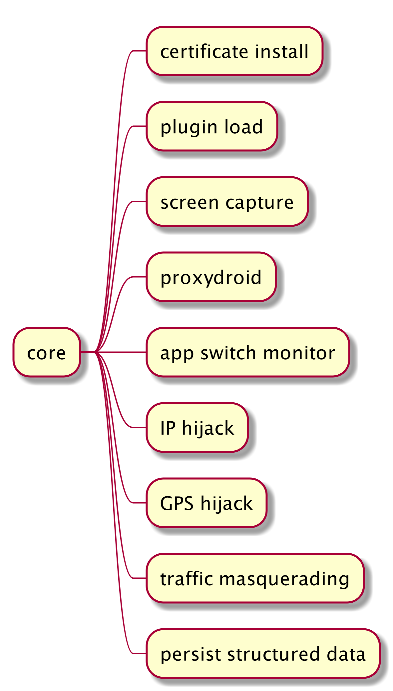

# 沙箱设计文档

## 一、需求分析

1. 广告内容取证（前期）
   * 适配广告件
   * 提高广告触发效率
     * IP伪装
     * GPS定位伪装
     * 网络环境伪装
   * 取证结果结构化存储
     * 本地JSON（前期）
     * 数据库服务器（后期）
2. 广告内容判定（后期）
   * 根据图片、文本等素材，构建打标系统，完成广告的自动分类

## 二、整体设计


## 三、沙箱运行流程


## 四、代码结构设计

沙箱目前分为以下几个模块：


下面说明各模块功能。

### 4.1 入口脚本模块

沙箱依赖于`mitmdump`，`mitmdump`根据沙箱提供的脚本对网络包的请求和响应进行处理，完成广告内容的取证。

针对不同设备的脚本类图如下所示:


在`BaseScript`中的`request`和`response`方法为分析流量包请求和响应的方法。

### 4.2 核心功能模块



该模块包含沙箱的核心功能，包括：

1. 设备mitm根证书安装

2. 插件加载

3. 流量转发工具proxydroid控制功能

4. 用户app切换监控

5. 设备截图

6. 设备IP伪装

   IP受限于云服务器的数量，所以无法随意切换，可以在沙箱启动时让用户选择IP，在运行过程中，也可以提供快捷键，用于切换IP。

7. 设备GPS伪装

   GPS可以随意切换，所以计划在沙箱启动时通过省-市-县等让用户自行选择初始GPS定位，在运行过程中，可以提供一组快捷键，用于随机跳转GPS定位。

8. 设备流量类型伪装（数据/Wi-Fi）

   网络环境有数据流量和Wi-Fi两种，可以在启动时让用户选择，在运行过程中，也可以提供快捷键，用于切换网络环境。

9. 结构化存储

   前期现将数据存储在`JSON`中，结构如下:

   ```json
   {
       "env": {//抓取环境相关
           "device_model": "Google Pixel 5",
           "sdk_level": 30,
           "traffic_type": "Wi-Fi",
           "ip": "北京东城",
           "gps": "北京东城"
       },
       "apk": {//apk信息相关
           "name": "触宝小月",
           "pkg_name": "com.example"
       },
       "ads": [//广告内容
           {
             	"uuid": "0271221a-236a-4a7e-91c8-52edf4a5604f",
               "time": "2015-03-27 21:27:28",
               "evidence": {//取证信息
                   "title": "xxxxx",
                   "desc": "xxxxx",
                   "ad_url": "xxxxx",
                   "ad_screenshot": "/path/to/ad_screenshot",
                   "ad_pic_url": "xxxxx",
                   "ad_pic_file": "/path/to/ad_pic_file"
               },
               "other": {//其他信息
                   "sdk_version": "3.2.11",
                   "slot_id": "121313",
                   "ad_type": "banner",
                   "ad_scene": "砸金蛋"
               }
           }
       ]
   }
   ```

   在运行过程中，会生成以下结构的文件树:

   ```
   .
   └── 2020-10-20_19-17-16
       └── 天天趣闻
           └── 推啊
               ├── output.json
               └── resource
                   └── 0271221a-236a-4a7e-91c8-52edf4a5604f
                       ├── ad.mitm
                       ├── ad_pic.png
                       └── ad_screenshot.png
   ```


### 4.3 数据模型模块


该模块包含结构化的数据：

1. 运行环境

   

2. apk信息

   
   
3. 广告信息

   

4. 广告sdk相关信息


### 4.4 资源模块


资源模块分为三个子模块：

1. 常量模块

   存储全局可用的常量

2. 文件路径模块

   存储沙箱使用的一些文件路径，例如：proxydroid apk存放路径、platform-tools存放路径、输出根目录、沙箱配置文件、插件配置文件等

3. 运行时模块

   存放一些需要初始化的变量，方便其他地方调用。例如：设备的device id、设备的sdk level、插件注册的函数等。


### 4.5 插件模块

目前插件分为以下几种类型：


入口脚本通过插件动态加载，完成各插件函数的注册，目前插件主要提供三种可供注册的函数：

```
ET_SWITCHED_APP 切换app
ET_REQUEST 请求
ET_RESPONSE 响应
```
在设备发生切换app、请求和响应时就会调用注册的函数，具体类图如下所示：


#### 4.5.1 广告取证插件

广告取证插件解析广告报文中的信息，并通过数据结构化存储模块将信息持久化。

#### 4.5.2 热键插件

热荐插件通过快捷键完成截图、数据包保存、IP切换等功能。

#### 4.5.3 通用插件

通用插件用于扩展不在主体功能以外的功能，例如意思广告平台URL的模糊匹配功能、访问过的URL存储功能等。

### 4.6 配置模块

该模块存储被加载的配置项，例如沙箱的配置、插件规则的配置等。

### 4.7 工具模块

该模块放置一些常用的工具函数。

## 五、开发计划

1. 结构化存储广告取证结果模块（1天）
2. 将现有插件输出迁移到结构化存储模块（1天）
3. 将环境伪装功能整合为热键插件（1天）
4. 调试验证环境伪装功能（1天）
5. 开发小牛互娱未完成广告件（5天）