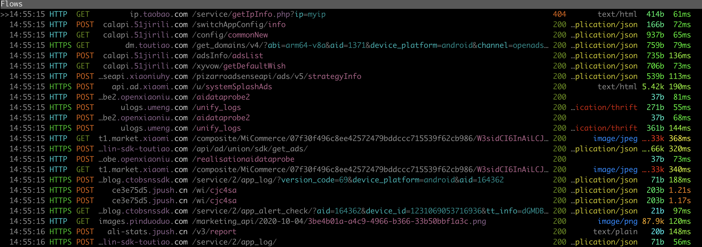
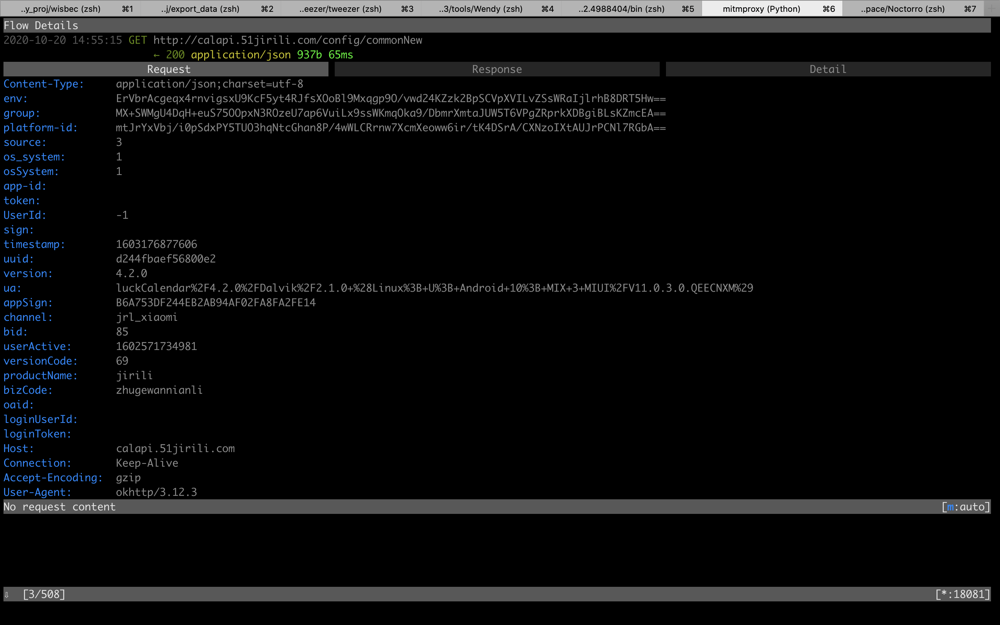
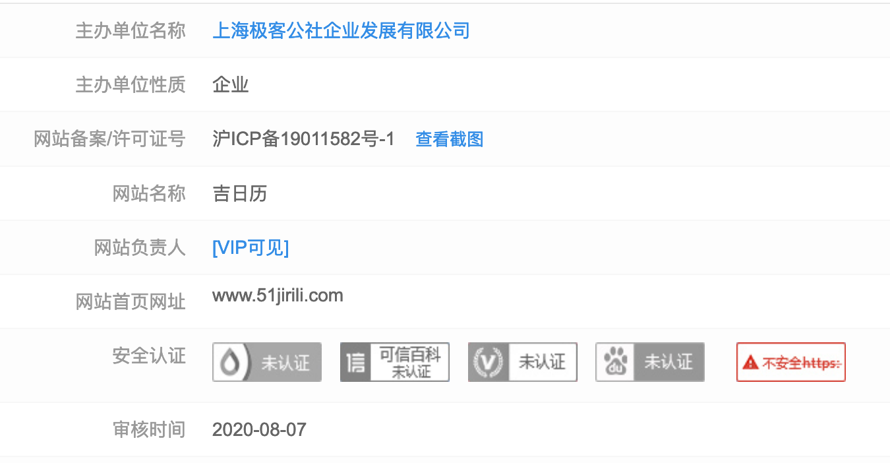

<!--
 * @Author: Rodney Cheung
 * @Date: 2020-10-20 14:27:14
 * @LastEditors: Rodney Cheung
 * @LastEditTime: 2020-10-20 16:05:39
 * @FilePath: /doc/package_analyze.md
-->
# 广告平台流量分析

本文档介绍了分析广告平台的流量包，并抓取其中较为关键信息的方法。

## 一、工具准备

### 1.1 mitmproxy

mitmproxy用于解析流量包。

#### 1.1.1 安装

对于任意平台均可以使用`pip install mitmproxy`来安装，如果是Mac OS系统，还可以使用`brew install mitmproxy`来安装。

#### 1.1.2 使用

`mitmproxy`提供了三个可执行文件，分别是：
```
mitmproxy
mitmweb
mitmdump
```

其中`mitmproxy`启动时使用`-p`指定端口，用于监控所有通过该端口的流量。`mitmweb`为前者的子集，但是具有图形界面。`mitmdump`则可以指定脚本，用于对监听流量进行处理。

在前期分析阶段，使用`mitmproxy`即可。使用步骤如下:

1. 将手机连接到电脑并确保adb畅通
2. 使用`sudo tweezer`启动沙箱（Windows电脑无需sudo），它会自动安装系统证书，证书安装完成后推出沙箱
3. 将手机的Wi-Fi设置代理为抓包电脑的IP，并选择一个端口号
4. 使用`mitmproxy -p 端口号`启动
5. 开始抓包

### 1.2 其余抓包工具

如果习惯于使用burp、Charles等抓包工具，可以自行按照教程安装证书。（不清楚是否能安装系统证书，所以可能有些包无法解析）

## 二、分析

本节以`mitmproxy`为例进行叙述。当`mitmproxy`启动后，如下图所示。


### 2.1 分析报文

使用回车键可以进入URL请求响应的详情，使用键盘的左右方向键可以在请求、响应和URL细节三个板块中切换。



#### 2.1.1 URL分析

URL是分析该包的第一步，当遇到未知的URL时，应该查询该域名的备案，可以在[这里](https://icplishi.com/)或者[这里](https://icp.chinaz.com/)查找。

例如，对于`calapi.51jirili.com`，他的备案信息为：


然后再去天眼查等平台搜索`上海极客公社企业发展有限公司`，可以发现该公司为小牛互娱有巨大关联，说明该域名为小牛互娱的域名，将域名信息记录。

#### 2.1.2 请求分析

一般来说，请求中一般只需要关注参数即可。

#### 2.1.3 响应分析

如果响应体中的内容如果是json，那么需要重点关注。例如：
```json
{
    "code": 0,
    "msg": "执行成功",
    "data": {
        "cityVoiceTime": 1,
        "syxsp": 2,
        "messageStreamConfig": 1,
        "yunying": 2,
        "deskAdShowTime": 40,
        "adList": {
            "zkList": [],
            "adList": [
                {
                    "productId": 797,
                    "adPosition": "cold_kp",
                    "showTimes": 0,
                    "adsInfos": [
                        {
                            "adId": "adpos_3301896301",
                            "adUnion": "midassdk",
                            "requestOrder": 1,
                            "adsAppId": "120001",
                            "adsChannelId": "midassdk",
                            "adsTimeout": 5
                        }
                    ]
                }
            ]
        },
        "pushOperationShowTime": 50,
        "pushAdShowTime": 60,
        "flashConfig": {
            "screenName": "诸葛国庆",
            "effectStartTime": 1601654400000,
            "effectEndTime": 1602172799000,
            "screenPic": "http://jirili-real.oss-cn-shanghai.aliyuncs.com/2020-10-08/1602155452452LiguoL.png",
            "bizCode": "zhugewannianli",
            "osSystem": 1,
            "jumpUrl": "1"
        },
        "gold": 2,
        "qifu": 2,
        "workRestCode": 1,
        "adSwitch": 2,
        "appTabConfig": {
            "wannianli": {
                "title": "万年历",
                "subtitle": "",
                "isOpen": 1,
                "iconUrl": "http://jirili-real.oss-cn-shanghai.aliyuncs.com/2020-07-08/1594197138118ytEz7S.png",
                "markUrl": "http://jirili-real.oss-cn-shanghai.aliyuncs.com/2020-07-08/159421271528366YNKQ.png",
                "backgroundUrl": "http://jirili-real.oss-cn-shanghai.aliyuncs.com/2020-07-08/15941971579164DmMD5.png",
                "startTime": 0,
                "endTime": 0,
                "showTimes": 99,
                "tabType": ""
            },
            "huangli": {
                "title": "祈福",
                "subtitle": "",
                "isOpen": 1,
                "iconUrl": "http://jirili-real.oss-cn-shanghai.aliyuncs.com/2020-09-29/1601386180860dqOGr7.png",
                "markUrl": "",
                "backgroundUrl": "http://jirili-real.oss-cn-shanghai.aliyuncs.com/2020-09-29/1601386185720WypDws.png",
                "startTime": 0,
                "endTime": 0,
                "showTimes": 0,
                "tabType": ""
            },
            "xiaoshipin": {
                "title": "小视频",
                "subtitle": "",
                "isOpen": 1,
                "iconUrl": "http://jirili-real.oss-cn-shanghai.aliyuncs.com/2020-07-22/1595389784718vfelOR.png",
                "markUrl": "http://jirili-real.oss-cn-shanghai.aliyuncs.com/2020-07-22/15953897989930A4GFK.png",
                "backgroundUrl": "http://jirili-real.oss-cn-shanghai.aliyuncs.com/2020-07-22/1595389790600SgfnUJ.png",
                "startTime": 0,
                "endTime": 0,
                "showTimes": 99,
                "tabType": ""
            },
            "tianqi": {
                "title": "天气",
                "subtitle": "",
                "isOpen": 1,
                "iconUrl": "http://jirili-real.oss-cn-shanghai.aliyuncs.com/2020-09-29/1601386225442fy8JuJ.gif",
                "markUrl": "",
                "backgroundUrl": "http://jirili-real.oss-cn-shanghai.aliyuncs.com/2020-09-29/1601386231358G0TUsZ.jpg",
                "startTime": 0,
                "endTime": 0,
                "showTimes": 0,
                "tabType": ""
            },
            "gongju": {
                "title": "工具",
                "subtitle": "",
                "isOpen": 1,
                "iconUrl": "http://jirili-real.oss-cn-shanghai.aliyuncs.com/2020-07-08/1594197228205Pv0D3k.png",
                "markUrl": "http://jirili-real.oss-cn-shanghai.aliyuncs.com/2020-07-08/1594212699283X1YC00.png",
                "backgroundUrl": "http://jirili-real.oss-cn-shanghai.aliyuncs.com/2020-07-08/1594197234305qxVhZL.png",
                "startTime": 0,
                "endTime": 0,
                "showTimes": 99,
                "tabType": ""
            }
        },
        "openWeatherTabTime": 168,
        "epidemicSwitch": 1,
        "holidayCode": 3,
        "weatherVoiceTime": 1,
        "gongjv": 2,
        "deskOperationShowTime": 30
    },
    "timestamp": 1603176915180
}
```
其中包含例如adsInfos、adList等敏感词汇，说明该响应体中可能包含广告的信息，所以应该将响应体保存到文件中具体分析（使用快捷键`b`即可将响应体输出到文件）。
具体分析是可以参考以下几点：
1. 关注json中的一些URL，例如这里的`iconUrl`，打开链接，发现是应用中的一个图标的图片资源
2. 还有一些关键词，例如`title`和`description`等，都有可能是广告的一些信息

如果分析之后确定与广告有关，应该将请求响应相关的内容保存下来。（可以仅保存一个URL，然后使用快捷键`w`将所有流量包保存到文件中）

### 2.2 域名过滤

在分析过程中，可以使用域名过滤，减少工作量。

#### 2.2.1 过滤已知域名

对于一些已知的域名，我们没有必要去关注他们，可以使用`mitmproxy`提供的过滤功能去除这些干扰，在上图所示的页面使用快捷键`f`，就可以进行过滤。直接粘贴下面的规则即可：

```
!qq.com & !pangolin-sdk-toutiao.com & !snssdk.com & !ctobsnssdk.com & !pglstatp-toutiao.com & !pstatp.com & !bytedance.com & !xiaomi.com & !miui.com & !toutiao.com & !baidu.com
```

其中域名前的感叹号表示取反，`&`表示and。上面的规则过滤了一些大公司的域名，例如百度、腾讯、小米等，可以根据自己的需求增减。

#### 2.2.2 特定域名搜索

在分析过程中，会遇到一些跟所分析公司或者广告sdk相关的URL，可以使用正选，将这些流量包单独过滤出来进行分析。还是使用快捷键`f`，语法与之前类似，例如:

```
51jirili.com & xiaoniuhy.com
```

## 三、输出

在完成分析后，应该完成以下输出：
1. 可能包含广告信息的URL
2. 所有流量包（w保存成一个文件即可）
3. 流量包中各域名的信息（URL、公司备案信息）

## 四、具体分析举例

[这里](https://wiki.avlyun.org/pages/viewpage.action?pageId=150838286&adc_code=436431)描述了推啊广告平台流量分析的具体流程，可以简单参考。