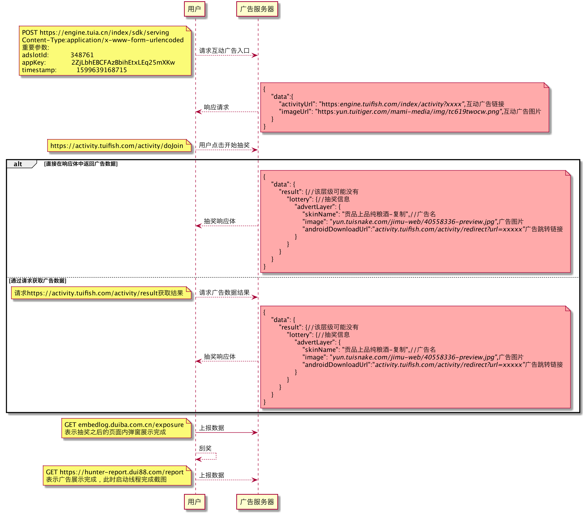

# 包分析输出模版

包分析的输出应该包含以下内容。

## 一、与广告sdk有关的域名

例如:

```
lkme.cc 北京微方程科技有限公司
suishenyun.net 南京微鲤科技有限公司
rili.cn 随身云（南京）信息技术有限公司
etouch.cn 随身云（南京）信息技术有限公司
weilitoutiao.net 北京微鲤科技有限公司
weliads.com 北京微鲤科技有限公司
```

## 二、与广告sdk有关的URL及其请求响应

例如(说明是POST/GET等请求类型，关键字段要附上注释)：

https://engine.tuia.cn/index/sdk/serving

请求参数：

```
tcid: 10102f1ba0d02759282c205544789167
adslotId: 348761//广告位ID
appKey: 2ZjLbhEBCFAzBbihEtxLEq25mXKw
md: H4sIAAAAAAAAAG2OsQ7CMAxE/8VzFaUVlIiNH2Bir6zEIKtqExq3VYX4dxxgYGDy3TudfA/AxN1CU+Y4whFqY42FCgIKXrZEBRVLC3vqOKh37aF1rW3q3d421mnKA/HfYBTFK19ZdcR3u6is9zSGKSqpIKHv8UZnHMo3H
wcjssX5PhtMSfMc+p+BjXHfiUJZOvlstPB8AYTEi8zKAAAA
timestamp: 1599639168715
nonce: 183013
signature: dd892a478703cc662a8179e478d9ad07cbec1f82
isimageUrl: 1
sourceType: 1
device_id: 867686021450208
deviceSlotExpCount: 7
```

响应：

```
{
    "code": "0",
    "desc": "成功",
    "data": {
        "activityUrl": "https://engine.tuifish.com/index/activity?appKey=2ZjLbhEBCFAzBbihEtxLEq25mXKw&adslotId=348761&userFromType=1&sckId=14&actsck=0&sckFromType=0&newApiRid=0ad0852ekemu2ze7-29538780&imei=1a7a62bbec7125fb91b512a5ee6debcc&sdkVersion=2.8.0.0",
        "imageUrl": "https://yun.tuitiger.com/mami-media/img/tc619twocw.png",//互动广告图片
        "sckId": 14,
        "reportClickUrl": "https://engine.tuifish.com/index/sdk/image/log?logType=1&SdkSlotTheoryAccessType=0&device_id=1a7a62bbec7125fb91b512a5ee6debcc&userFromType=1&SdkSlotActualAccessType=0&sckId=14&imageLogId=e070aaf202c49bb1026a9324e38c9a1a&md=H4sIAAAAAAAAAG2OsQ7CMAxE%2F8VzFaUVlIiNH2Bir6zEIKtqExq3VYX4dxxgYGDy3TudfA%2FAxN1CU%2BY4whFqY42FCgIKXrZEBRVLC3vqOKh37aF1rW3q3d421mnKA%2FHfYBTFK19ZdcR3u6is9zSGKSqpIKHv8UZnHMo3HwcjssX5PhtMSfMc%2Bp%2BBjXHfiUJZOvlstPB8AYTEi8zKAAAA&sckFromType=0&adslotId=348761&newApiRid=0ad0852ekemu2ze7-29538780&sdkVersion=2.8.0.0&appKey=2ZjLbhEBCFAzBbihEtxLEq25mXKw&theoryInteractiveType=0",
        "reportExposureUrl": "https://engine.tuifish.com/index/sdk/image/log?logType=0&SdkSlotTheoryAccessType=0&device_id=1a7a62bbec7125fb91b512a5ee6debcc&userFromType=1&SdkSlotActualAccessType=0&sckId=14&imageLogId=e070aaf202c49bb1026a9324e38c9a1a&md=H4sIAAAAAAAAAG2OsQ7CMAxE%2F8VzFaUVlIiNH2Bir6zEIKtqExq3VYX4dxxgYGDy3TudfA%2FAxN1CU%2BY4whFqY42FCgIKXrZEBRVLC3vqOKh37aF1rW3q3d421mnKA%2FHfYBTFK19ZdcR3u6is9zSGKSqpIKHv8UZnHMo3HwcjssX5PhtMSfMc%2Bp%2BBjXHfiUJZOvlstPB8AYTEi8zKAAAA&sckFromType=0&adslotId=348761&newApiRid=0ad0852ekemu2ze7-29538780&sdkVersion=2.8.0.0&appKey=2ZjLbhEBCFAzBbihEtxLEq25mXKw&theoryInteractiveType=0",
        "extTitle": null,
        "extDesc": null,
        "size": "150*150",
        "isVisibleOfIcon": false,
        "isVisibleOfCloseButton": false,
        "isSdkType": true,
        "imageWidth": 150,
        "imageHeight": 150,
        "sceneType": 6,
        "specType": 0,
        "imageUrlList": [
            "https://yun.tuitiger.com/mami-media/img/tc619twocw.png"
        ],
        "advertSdkRsp": null,
        "isDownloadAd": false,
        "sdkDsmLogRsp": null,
        "theoryInteractiveType": 0,
        "theoryInteractiveTypes": [],
        "textLinkBubbleUrl": null,
        "iconPlayInterval": null
    },
    "success": true
}
```

## 三、各广告URL之间的联系

例如(说清楚关系即可):



